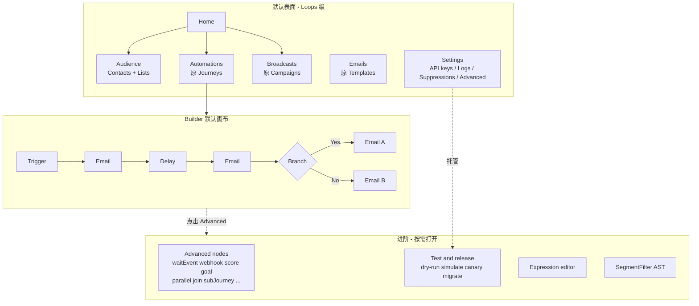

# PLAN: 要灵活，不要更复杂 — 对标 Loops.so 的产品简化

## 问题

Loopkit 引擎能力已经很强，但**产品表面把引擎概念全部平铺了**。对照 Loops.so，复杂度不在「缺功能」，而在「一打开就同时看到所有能力」。

| 维度 | Loopkit 现状 | Loops.so |
| --- | --- | --- |
| Journey 节点 | 19 种（trigger/delay/email/sendCampaign/notify/branch/split/abSplit/filter/timeWindow/waitEvent/webhook/updateContact/score/goal/exit/parallel/join/subJourney） | **6 种**：Trigger / Email / Timer / Audience filter / Branch / Experiment |
| 侧边栏 | 5 组 9 项（Home / Contacts / Audiences / Journeys / Campaigns / Templates / Suppressions / API keys / Logs） | 扁平、少概念：Home / Emails / Loops / Contacts / Forms / Settings |
| 发送路径 | 首页就展示三路选择器（Lifecycle / Broadcast / Transactional） | 同样三类，但**不教育用户先选路径**，直接从 Emails 或 Loops 进入 |
| 新建 Journey 默认模板 | 默认选中 **Welcome + A/B + Score + Hours**（实验 + 打分 + 营业时段 + goal） | 从空白或简单模板起步；复杂 playbook 是示例不是默认 |
| Builder 交互 | 自由画布 + 左侧全量节点面板 + 2200 行 Inspector | 线性路径为主；**悬停箭头点 `+` 插入**；分支自动挂 Audience filter |
| 条件配置 | 原始表达式 `{{ contact.plan }} == "pro"` | 属性选择器 + 受众过滤 UI |
| Journey 详情页 | Builder / **Lab**（Preview→Simulate→Optimize→Canary→Migrate）/ Runs / Funnel | Build / Metrics；测试用 `@example.com` 即可 |
| 默认模板内容 | score、A/B、timeWindow、notify 一上来就齐 | 触发 → 邮件 → 定时器 → 结束 |

**用户要的是灵活性，不是更复杂的表面。** 灵活性应来自：同一套引擎/图/编译，**默认路径短、进阶按需展开**；而不是删掉能力或继续堆面板。

## 设计原则

**默认像 Loops 一样简单，需要时像引擎一样一样强大。**

1. **表面收敛，能力不删** — 节点、API、编译路径、DLQ/canary/migrate 全部保留；UI 默认只露核心闭环。
2. **Progressive disclosure** — 核心 6 节点常驻；其余进「Advanced」抽屉；Lab/合规/开发者进 Settings 或 overflow。
3. **条件优先 UI，表达式可选** — 属性下拉 + 运算符是主路径；表达式编辑器是 Advanced 逃生口。
4. **默认模板 = 可发送的最短路径** — Welcome：Trigger → Email → Delay → Email → Exit。实验/打分/时段是可选 playbook，不是默认选中。
5. **概念少而准** — 用户心智：Contacts + Automations（自动邮件）+ Broadcasts（群发）+ Emails（内容）。Transactional 是 API，不是第三块仪表盘产品。
6. **同一条编译路径** — UI 简化不得引入第二套图格式或旁路发布；仍是 `validateGraph → publish → assertWhitelisted → compile`。

## 目标产品模型



**术语（建议，可改）：**

| 现状 | 建议 | 理由 |
| --- | --- | --- |
| Journeys | Automations / 自动化 | 与 Loops「Loops/Workflows」对齐，比 Journey 更「产品」 |
| Campaigns | Broadcasts / 群发 | 对比自动化的「一次发送」 |
| Templates | Emails / 邮件 | 内容资产，不是工程对象 |
| Suppressions / Logs / API keys | Settings 分区 | 运维与集成，不是日常工作流 |

**不改后端 schema/API 命名**（仍可叫 journey/campaign/template），只改界面语言与 IA。

## 核心节点模型（对照 Loops）

默认节点面板 **只展示 6 类**（可与 Loops 一一对应）：

| 默认节点 | 对应现状类型 | 说明 |
| --- | --- | --- |
| Trigger | trigger | contact_created / event / property_changed / list |
| Email | email（+ sendCampaign 可折叠为「发送已有邮件」） | 选模板 + 可选覆盖 subject |
| Delay | delay | 「立即 / N 分钟/小时/天」；until/weekly 进 Advanced |
| Filter | filter + branch 的条件 UI | 属性条件；「仅下一步 / 后续全部」 |
| Branch | branch + split + abSplit 的统一入口 | 默认二分（匹配 / 不匹配）；A/B 与多路由是 Branch 的 Advanced 模式 |
| Experiment | abSplit | 权重 A/B；默认节点可与 Branch 合并入口，画布上仍为独立节点 |

**Advanced 抽屉（默认折叠，搜索可达）：** waitEvent, timeWindow, updateContact, score, goal, notify, webhook, sendCampaign, parallel, join, subJourney, exit（exit 可自动挂或保留在「结束」隐式语义，不必强推给用户）。

已有图若含高级节点：**画布正常渲染，不隐藏**；仅新建时面板默认不展示。不得让旧图变成「打不开的高级模式」。

## Builder 交互（对标 Loops）

现状：`JourneyBuilder.tsx` 约 2200 行，左侧全量 palette + 自由拖拽 + 长 Inspector。

目标：

1. **线性默认路径** — 新建后垂直流：Trigger → Email → Delay → Email。自动布局即可，减少「空白画布恐惧」。
2. **边上 `+` 插入** — 悬停 edge 显示 `+`，弹出**精简**节点菜单（6 个默认项 + Advanced 入口），插入时自动断边重连。
3. **分支一键创建** — 选 Branch 时自动插入「Filter A / Filter B」（或条件挂在 branch 上），对齐 Loops「点 Branch 自动出 audience filter」。
4. **Inspector 主路径表单化** — Email：选模板/主题；Delay：数字+单位；Filter：属性/运算符/值；Experiment：两列权重。**表达式 textarea 降为 Advanced 折叠区**。
5. **Lab 降级** — Journey 详情默认 Tab：Build / Activity（Runs+Funnel 合并或并列）；Lab 整体移入 `···` → Test & release，或 Settings → Advanced workflows。
6. **自由画布保留** — React Flow 平移/缩放/MiniMap 保留；自由拖拽不再是主叙事。

## 条件与受众：灵活但不暴露 AST

- **Journey 内 Filter/Branch 主 UI**：属性选择器（联系人字段）+ 运算符（是/不是/大于/包含/存在）+ 值；生成的仍是 `SegmentFilter` 或简单 expression，**编译层不变**。
- **Audiences**：保留 saved segment；新建时主 UI 是同一属性选择器；「Edit as JSON / advanced AST」进 Advanced。
- **describeRows 自然语言预览**（已有人群编辑器优点）**提升到 journey filter 侧边栏**，降低表达式恐惧。
- 原始 `{{ contact.plan }} == "pro"` 表达式能力保留，作为 Advanced，不删除。

## 默认模板与 Home

**模板（新建时 3 个，默认第 1 个）：**

1. **Welcome drip（默认）** — Trigger contact_created → Email welcome → Delay 1d → Email tips → Exit。`blank-welcome` 去掉默认 score 节点。
2. **Onboarding branch** — Welcome → Delay → Filter paid → Yes: upgrade email / No: education email → Exit。
3. **Winback** — Trigger event/property（如 inactive）→ Delay → Email → Filter → Exit。

`Welcome + A/B + Score + Hours` **降级到「More examples」**，不默认选中；`standard-welcome-sequence`（subJourney）同理，进 Advanced examples。

**Home：**

- 去掉三路 MessagingPathPicker 的教育墙（或移出首页首屏，仅在用户点「New email/send」时作为轻量二选一：自动化 vs 群发）。
- 首屏：**4 个数字**（Contacts / Active automations / Emails sent 7d / Delivery health）+ **一个主 CTA**（Create automation / Send a broadcast）+ 最近活动。
- Quick start API curl 收进 Settings → API keys 或首页底部折叠，不抢首屏。

**侧边栏目标（5 项 + Settings）：**

```
Home
Contacts
Automations
Broadcasts
Emails
Settings
  ├ API keys
  ├ Logs / DLQ
  ├ Suppressions
  └ Advanced (Lab, node catalog, expressions)
```

## 灵活性「藏在后面、调得出来」

| 能力 | 默认用户是否看见 | 仍如何使用 |
| --- | --- | --- |
| 19 种节点 | 否，只见 6 | Advanced 抽屉 / 搜索；旧图全量可编辑 |
| 表达式 branch/split | 否，属性 UI | Inspector Advanced → Expression |
| Journey Lab 五段 | 否 | 详情页 overflow / Settings Advanced |
| Canary / run migrate | 否 | 同上；API 不变 |
| Dual compliance Contact 360 | 简化文案，双门控逻辑不改 | Contact 详情默认「可发送/不可发送 + 原因」；抑制列表在 Settings |
| SegmentFilter AST | 否 | Audiences Advanced 编辑 |
| Transactional API | 不占主导航 | Settings → API + Templates → Test send |
| Copilot 多入口 | 收敛为每面一个入口 | Builder / Email / Audience 各保留；去掉 Lab 内重复教育 |
| 引擎 DLQ / webhook / score… | 否 | 不删除，不进默认 UI |

**工程约束：**

- 不改 `packages/journey` 图类型与 `compile/validate/whitelist` 契约（除非发现阻塞；届时单独小步改）。
- UI 节点可见性用 `NODE_TIER: Record<BuilderNodeType, "core" | "advanced">` 驱动，而不是硬编码删除 meta。
- 表达式 ↔ 属性 UI 双向：无法无损映射的表达式，UI 显示「Custom expression」并允许切回 Advanced，禁止静默改写用户条件。

## 实施阶段

### Phase 1 — IA 与默认模板（感知复杂度最大收益）

- [ ] 侧边栏收敛为 5 项 + Settings；Suppressions/Logs/API keys 迁入 Settings 路由（可先保留原 URL 做 redirect）。
- [ ] Home 去掉三路选择器首屏；主 CTA + 关键指标。
- [ ] 新建 Automation 默认模板改为 Welcome drip（无 score）；复杂模板移入 More examples。
- [ ] 文案：Journeys→Automations（UI 文案层），Campaigns→Broadcasts，Templates→Emails（导航标签）。

### Phase 2 — Journey Builder 核心闭环

- [ ] `NODE_TIER` + palette 默认仅 core 6；Advanced 抽屉 + 搜索。
- [ ] Edge `+` 插入精简菜单；Branch 一键创建双 Filter 路径。
- [ ] Inspector：Email/Delay/Filter/Experiment 表单化主路径；表达式进 Advanced 折叠。
- [ ] 新图默认纵向自动布局；`emptyWelcomeGraph` 去 score。
- [ ] 旧图兼容：含 advanced 节点仍完整渲染与编辑。

### Phase 3 — 条件 UI 与 Lab 降级

- [ ] Filter/Branch 属性选择器复用/对齐 `AudienceFilterBuilder` 字段选项；侧栏显示自然语言描述 + live match（若可）。
- [ ] Journey 详情：默认 Build + Activity；Lab 入口移入 `···`。
- [ ] Compliance 对外文案简化（双门控逻辑与 webhook 行为不变）。

### Phase 4 — 打磨与回归

- [ ] 发布路径回归：simple journey publish → contact ingest → welcome → delay → complete。
- [ ] 含 advanced 节点的旧模板图：打开、编辑、发布、dry-run。
- [ ] `pnpm -w check-types` + 相关包测试。
- [ ] 手动走一遍 Loops 级 golden path：注册 → 选 Welcome → 发布 → API 造联系人 → 看到两封邮件。

## 非目标

- 不做多副本水平扩展、不改单实例锁设计。
- 不重写引擎、不删编译能力、不砍 API。
- 不做像素级克隆 Loops 视觉；借鉴的是**信息架构与默认路径**，不是品牌。
- 本阶段不引入新的营销节点类型；不「为了灵活」再加一层抽象。

## 成功标准（可感知）

1. 新用户打开产品，默认侧边栏 **≤6 个主导航项**，首页不被迫选择发送哲学。
2. 新建自动化后 **30 秒内** 能理解画布：最长主路径节点数 ≤5，默认无 score/A/B/营业时段。
3. 节点面板默认可见类型 **≤6**；任何高级能力 **1 次点击内可达**（Advanced 抽屉或 Settings）。
4. 发布一条简单自动化所需的非默认决策点 **≤5**（名称、模板、触发、发送、启动）。
5. 旧能力零丢失：测试与 API 行为与现状一致。

## 关键文件

| 区域 | 路径 |
| --- | --- |
| 侧边栏 IA | `apps/web/src/components/app-sidebar.tsx` |
| 路由壳 | `apps/web/src/routes/_auth/route.tsx`，`routes/_auth/**` |
| Home / 路径选择 | `apps/web/src/routes/_auth/dashboard.tsx`，`features/messaging/MessagingPathPicker.tsx` |
| 节点元数据与模板 | `apps/web/src/features/journey-builder/graph.ts`，`packages/journey/src/presets.ts` |
| Builder | `apps/web/src/features/journey-builder/JourneyBuilder.tsx`（palette/Inspector/边上插入） |
| 详情页与 Lab | `apps/web/src/routes/_auth/journeys/$journeyId.tsx`，`features/journey-builder/JourneyLab.tsx` |
| 条件 UI | `features/audiences/AudienceFilterBuilder.tsx`，`features/journey-builder/JourneyBuilder.tsx` 条件字段 |
| 图类型/编译（只读约束） | `packages/journey/src/types.ts`，`compile.ts`，`validate.ts`，`whitelist.ts` |

## 决策摘要（给实现阶段）

| 决策 | 选择 |
| --- | --- |
| 复杂功能 | **隐藏，不删除** |
| 默认节点 | 6 个 core；13 个 advanced 进抽屉 |
| 默认模板 | Welcome drip；复杂样例降级 |
| 表达式 | Advanced；主路径属性选择器 |
| Lab/canary/migrate | 降级入口；能力保留 |
| 导航 | 收敛 + Settings 托管运维面 |
| 引擎/API/schema | 原则上不动 |
| 命名 | UI 文案向 Automations/Broadcasts/Emails 靠拢，API 名可暂留 |
